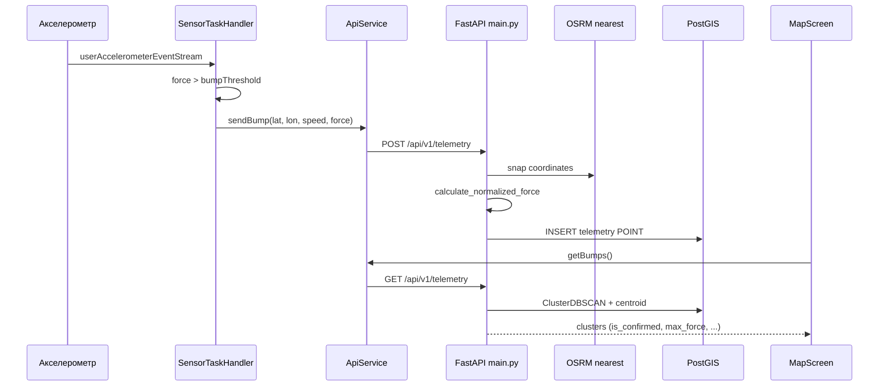

# Архитектура EasyRide

Карта исходников monorepo: **роль файла** и **публичные сущности**.  
Платформенные и генерируемые каталоги (`android/`, `ios/`, `build/`, `venv/`, `.dart_tool/` и т.п.) здесь не расписываются — не править без явной нужды.

См. также: [README.md](./README.md) · [AGENTS.md](./AGENTS.md)

---

## Общая схема



```
projects/
├── easyride_app/          # Flutter-клиент
│   └── lib/               # исходники UI и сервисов
└── easyride_backend/      # FastAPI + модели + Docker PostGIS
```

---

## Backend — `easyride_backend/`

```
easyride_backend/
├── main.py              # приложение FastAPI, эндпоинты, OSRM, нормализация
├── models.py            # ORM-модель телеметрии
├── database.py          # engine, сессии, Base
├── docker-compose.yml   # PostGIS 15
└── requirements.txt     # Python-зависимости
```

### `main.py`

Точка входа API. При старте: `CREATE EXTENSION postgis`, `create_all` таблиц.

| Сущность | Тип | Назначение |
|----------|-----|------------|
| `app` | `FastAPI` | Приложение `"EasyRide MVP API"` |
| `TelemetryPayload` | Pydantic model | `user_id`, `latitude`, `longitude`, `speed_kmh`, `bump_force` |
| `get_snapped_coordinates(lat, lon)` | function | Snap к дороге через OSRM; при ошибке — исходные координаты |
| `calculate_normalized_force(bump_force, speed_kmh)` | function | Нормализация силы удара относительно скорости (база 20 км/ч) |
| `health` | `GET /health` | Проверка БД и PostGIS |
| `receive_telemetry` | `POST /api/v1/telemetry` | Snap → normalize → insert `TelemetryData` |
| `get_telemetry` | `GET /api/v1/telemetry` | `ST_ClusterDBSCAN` → centroid, счётчики, `is_confirmed` |

**Правило подтверждения кластера:** `unique_users >= 2` **или** `total_hits >= 3`.

### `models.py`

| Сущность | Тип | Назначение |
|----------|-----|------------|
| `TelemetryData` | SQLAlchemy model | Таблица `telemetry`: `id`, `user_id`, `location` (Geometry POINT, SRID 4326), `speed_kmh`, `bump_force`, `timestamp` |

### `database.py`

| Сущность | Тип | Назначение |
|----------|-----|------------|
| `DATABASE_URL` | str | DSN Postgres (dev) |
| `engine` | Engine | SQLAlchemy engine |
| `SessionLocal` | sessionmaker | Фабрика сессий |
| `Base` | DeclarativeBase | База моделей |
| `get_db()` | generator | Dependency FastAPI: yield session, close в `finally` |

### `docker-compose.yml`

Сервис `db`: образ `postgis/postgis:15-3.3`, порт `5432`, volume `postgis_data`.

---

## Frontend — `easyride_app/lib/`

```
lib/
├── main.dart                    # entry, MyApp, Dashboard (логи + foreground)
├── main_scaffold.dart           # shell + bottom nav
├── map_screen.dart              # карта кластеров
├── list_screen.dart             # список ям (мок UI)
├── detect_screen.dart           # UI детекции + переход в Dashboard
├── pothole_details_screen.dart  # детали ямы (мок UI)
├── profile_screen.dart          # профиль (мок UI)
├── api_service.dart             # HTTP + in-memory логи
├── sensor_service.dart          # background TaskHandler акселерометра
├── app_theme.dart               # цвета и ThemeData
└── widgets/
    └── glass_panel.dart         # glassmorphism-контейнер
```

### `main.dart`

| Сущность | Тип | Назначение |
|----------|-----|------------|
| `main()` | entry | `ensureInitialized`, init communication port, `runApp` |
| `MyApp` | StatelessWidget | `MaterialApp` + `AppTheme.lightTheme`, home = `MainScaffold` |
| `Dashboard` | StatefulWidget | MVP-экран логов, старт/стоп `FlutterForegroundTask` |
| `_initForegroundTask` | method | Permissions + `FlutterForegroundTask.init` |
| `_toggleTracking` | method | start/stop service с `startCallback` |
| `_onReceiveTaskData` | method | Строки из фона → `ApiService.addLog` |

### `main_scaffold.dart`

| Сущность | Тип | Назначение |
|----------|-----|------------|
| `MainScaffold` | StatefulWidget | `IndexedStack`: Карта / Список / Детекция / Профиль + glass bottom nav |

### `map_screen.dart`

| Сущность | Тип | Назначение |
|----------|-----|------------|
| `MapScreen` | StatefulWidget | `flutter_map`: загрузка bumps, GPS пользователя, круги (confirmed) / маркеры (unconfirmed) по `max_force` |

### `list_screen.dart`

| Сущность | Тип | Назначение |
|----------|-----|------------|
| `ListScreen` | StatefulWidget | Список «обнаруженных ям» с фильтрами; **данные заглушки**, переход в `PotholeDetailsScreen` |

### `detect_screen.dart`

| Сущность | Тип | Назначение |
|----------|-----|------------|
| `DetectScreen` | StatelessWidget | UI: спидометр, waveform, mini-map, alert; кнопка → `Dashboard` |
| `WaveformPainter` | CustomPainter | Отрисовка волны удара |

### `pothole_details_screen.dart`

| Сущность | Тип | Назначение |
|----------|-----|------------|
| `PotholeDetailsScreen` | StatelessWidget | Экран деталей ямы (мок: info grid, mini-map, comments UI) |

### `profile_screen.dart`

| Сущность | Тип | Назначение |
|----------|-----|------------|
| `ProfileScreen` | StatelessWidget | Профиль: stats, badges, heatmap UI (мок) |

### `api_service.dart`

| Сущность | Тип | Назначение |
|----------|-----|------------|
| `ApiService` | class (static) | Клиент backend |
| `apiUrl` | const | `.../api/v1/telemetry` |
| `logs` | `ValueNotifier<List<String>>` | Логи для UI Dashboard |
| `addLog(message)` | static | Добавить строку лога (только UI-поток) |
| `sendBump(lat, lon, speed, force)` | static Future\<bool\> | `POST` телеметрии |
| `getBumps()` | static Future\<List\> | `GET` кластеров |

### `sensor_service.dart`

| Сущность | Тип | Назначение |
|----------|-----|------------|
| `startCallback()` | entry-point | Регистрация `SensorTaskHandler` для isolate foreground task |
| `SensorTaskHandler` | TaskHandler | Слушает accel, порог `bumpThreshold = 7.0`, GPS, `ApiService.sendBump`, cooldown 2 с, сообщения в main isolate |

### `app_theme.dart`

| Сущность | Тип | Назначение |
|----------|-----|------------|
| `AppColors` | class | Палитра: primary, secondary, danger, warning, bg, text… |
| `AppTheme.lightTheme` | ThemeData | Светлая тема Material |

### `widgets/glass_panel.dart`

| Сущность | Тип | Назначение |
|----------|-----|------------|
| `GlassPanel` | StatelessWidget | Blur + полупрозрачный контейнер (bottom nav и панели) |

---

## Потоки данных (кратко)

### Запись ямы

1. `SensorTaskHandler.onStart` → stream акселерометра  
2. `force = sqrt(x²+y²+z²)` > `bumpThreshold`  
3. `Geolocator.getCurrentPosition` + `speed * 3.6`  
4. `ApiService.sendBump` → `POST /api/v1/telemetry`  
5. Backend: OSRM snap → `calculate_normalized_force` → `TelemetryData` в PostGIS  

### Чтение карты

1. `MapScreen._loadBumps` → `ApiService.getBumps`  
2. `GET /api/v1/telemetry` → кластеры  
3. `is_confirmed` → цветной `CircleMarker`, иначе серый `Marker`  

---

## Границы модулей (как задумано)

| Слой | Должен делать | Не должен |
|------|----------------|-----------|
| `sensor_service` | Датчики, порог, вызов API | UI, тема |
| `api_service` | HTTP, URL, логи-буфер | Виджеты, бизнес-пороги датчиков |
| Экраны (`*_screen`) | UI и навигация | Дублировать HTTP-логику (использовать `ApiService`) |
| `main.py` | HTTP + orchestration | (при росте) — разнести routes/services) |
| `models` / `database` | Схема и сессии | HTTP-ответы |

При добавлении файла или публичной функции — обнови этот документ.
